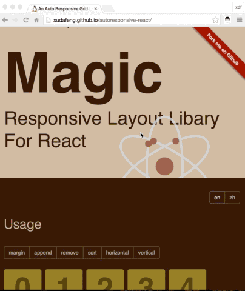
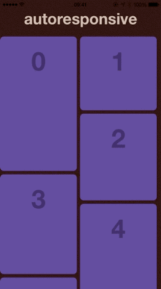

# autoresponsive-react

---

Auto responsive grid layout library for [React](http://facebook.github.io/react/index.html).

[![NPM version][npm-image]][npm-url]
[![build status][travis-image]][travis-url]
[![Test coverage][coveralls-image]][coveralls-url]
[![node version][node-image]][node-url]

[npm-image]: http://img.shields.io/npm/v/autoresponsive-react.svg?style=flat-square
[npm-url]: http://npmjs.org/package/autoresponsive-react
[travis-image]: https://img.shields.io/travis/xudafeng/autoresponsive-react.svg?style=flat-square
[travis-url]: https://travis-ci.org/xudafeng/autoresponsive-react
[coveralls-image]: https://img.shields.io/coveralls/xudafeng/autoresponsive-react.svg?style=flat-square
[coveralls-url]: https://coveralls.io/r/xudafeng/autoresponsive-react?branch=master
[node-image]: https://img.shields.io/badge/node.js-%3E=8-green.svg?style=flat-square
[node-url]: http://nodejs.org/download/






## Examples

Live demo & docs: [xudafeng.github.io/autoresponsive-react](https://xudafeng.github.io/autoresponsive-react/)

To build the examples local, please run:

```bash
$ npm i
$ npm run dev
```

## Installation

```bash
$ npm i autoresponsive-react --save-dev
```

## Related Edition

- [ReactNative Edition](//github.com/xudafeng/autoresponsive-react-native)
- [Vue Edition](//github.com/xudafeng/autoresponsive-vue)

## Contributing

See our [CONTRIBUTING.md](./CONTRIBUTING.md) for information on how to contribute.

<!-- GITCONTRIBUTOR_START -->

## Contributors

|[<br/><sub><b>xudafeng</b></sub>](https://github.com/xudafeng)<br/>|[<br/><sub><b>HillLiu</b></sub>](https://github.com/HillLiu)<br/>|[<br/><sub><b>conorhastings</b></sub>](https://github.com/conorhastings)<br/>|[<br/><sub><b>montogeek</b></sub>](https://github.com/montogeek)<br/>|[<br/><sub><b>rayshan</b></sub>](https://github.com/rayshan)<br/>|[<br/><sub><b>catchonme</b></sub>](https://github.com/catchonme)<br/>
| :---: | :---: | :---: | :---: | :---: | :---: |


This project follows the git-contributor [spec](https://github.com/xudafeng/git-contributor), auto upated at `Sat Apr 21 2018 11:33:26 GMT+0800`.

<!-- GITCONTRIBUTOR_END -->

## License

MIT Licensed.
